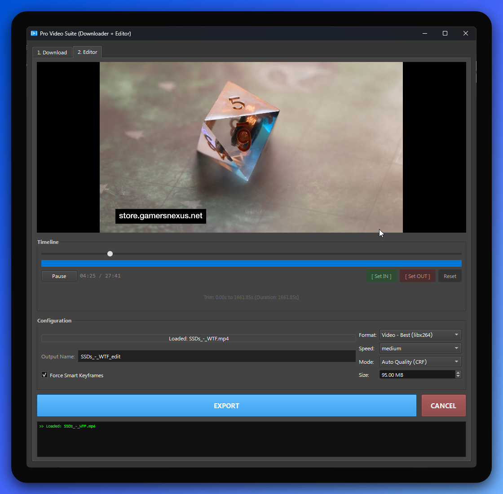

|  Pro Video Suite (Downloader + Editor) |
| :---: |
|  |

Welcome to the **Pro Video Suite**! This application is a handy, all-in-one tool that lets you download videos from YouTube (and other supported sites) and edit them right away.

Whether you're just looking to save a video for offline viewing, trim a long clip, or extract the audio as an MP3, this app has you covered!

---

## 🟢 For Beginners: Getting Started

### What does this app do?
1. **Download Videos**: Paste a video link, and the app will download it to your computer at high quality.
2. **Trim & Cut**: Open any video file and select only the part you want to keep. No more sharing a 10-minute video when you only need a 10-second clip!
3. **Convert Formats**: Save your edited video as an MP4, or extract just the audio as an MP3 or M4A file.
4. **Control Quality**: Choose exactly how large you want your final video file to be, or let the app automatically choose the best quality.

### Prerequisites
To run this application, you need to have a few things installed on your computer:
1. **Python 3.8+**: The programming language the app is built with.
2. **yt-dlp**: A tool the app uses to download videos.
3. **FFmpeg**: A powerful tool the app uses to process, trim, and convert videos.

### How to Install and Run
1. **Install Python dependencies**:
   Open your terminal or command prompt in the project folder and run:
   ```bash
   pip install -r requirements.txt
   ```
2. **Install FFmpeg and yt-dlp**:
   - **Windows**: You can download them using a package manager like `winget` or `choco`, or download the executables manually and add them to your system's PATH.
   - **Mac**: Use Homebrew: `brew install ffmpeg yt-dlp`
   - **Linux**: Use your package manager: `sudo apt install ffmpeg yt-dlp` (or equivalent).
3. **Start the App**:
   Run the following command:
   ```bash
   python downloader.py
   ```

### How to Use the App
- **Downloading**: Go to the "1. Download" tab. Paste a YouTube URL and click "DOWNLOAD & LOAD". Once finished, it will automatically open the video in the editor.
- **Editing**: Go to the "2. Editor" tab.
  - Use the timeline slider to find the part of the video you want.
  - Click **[ Set IN ]** to mark the start of your clip.
  - Click **[ Set OUT ]** to mark the end of your clip.
  - Choose your output format (Video or Audio Only) and click **EXPORT**!

---

## 🛠️ For Developers: Under the Hood

This section provides technical details for developers who want to understand the codebase, modify it, or contribute to the project.

### Tech Stack
- **GUI Framework**: [PySide6](https://doc.qt.io/qtforpython-6/) (Qt for Python). We use `QMediaPlayer` and `QVideoWidget` for media playback.
- **Downloading**: `subprocess` calls to `yt-dlp`.
- **Media Processing**: `subprocess` calls to `ffmpeg` and `ffprobe`.

### Project Structure
- `downloader.py`: The single entry point containing all logic, UI components, and worker threads.
- `requirements.txt`: Python package dependencies (primarily `PySide6`).

### Architecture Overview
The application is structured around a central `VideoEditorApp` widget (inheriting from `QWidget`) which contains two main tabs, and two independent `QThread` workers to prevent blocking the UI during heavy I/O or CPU operations.

#### 1. UI Components
- **`VideoEditorApp`**: Main window class initializing the UI, setting up the `QTabWidget`, and orchestrating interactions between the tabs and the media player.
- **`RangeBar`**: A custom `QWidget` that overrides `paintEvent` to draw a visual representation of the trimmed selection on the timeline.
- **Custom Theming**: A customized dark mode `QPalette` is applied at the `QApplication` level to ensure a consistent, modern look across OS platforms.

#### 2. Background Workers (`QThread`)
To keep the main Qt event loop responsive, long-running shell commands are offloaded to worker threads:
- **`DownloadWorker`**:
  - First, executes `yt-dlp --get-filename` to determine the expected output name.
  - Forces an H.264 MP4 container download (`-S vcodec:h264,res,acodec:m4a`) to ensure maximum compatibility with the Qt Multimedia preview widget.
  - Streams `stdout` to emit progress updates back to the UI.
- **`ConversionWorker`**:
  - Executes `ffmpeg` with the provided arguments for trimming, re-encoding, and scaling.
  - Streams the `ffmpeg` console output to the UI log.
  - Can be cleanly interrupted (killed) if the user cancels the export.

#### 3. Video Playback & Seeking Logic
- The `QMediaPlayer` is tightly integrated with a custom `QSlider` and the `RangeBar`.
- **Looping mechanism**: During trimming, if an IN and OUT point are set, the application continuously checks the player position (`position_changed` signal). If the position exceeds the OUT point (`end_ms`), it seamlessly resets to the IN point (`start_ms`).

### Extending the Application
If you wish to add new features, here are a few starting points:
- **More Encoders**: Add new hardware encoders (like Intel QuickSync) in the `populate_encoders` method inside `VideoEditorApp`.
- **Advanced FFmpeg Filters**: Modify the `start_encoding` method to inject additional `ffmpeg` video filters (`-vf`), such as text overlays, watermarks, or color correction.
- **Queue System**: Currently, the app handles one download/export at a time. You could extend the architecture to use a queue (`queue.Queue`) and allow batch processing.

### Developer Setup
1. Clone the repository.
2. Create a virtual environment: `python -m venv .venv`
3. Activate the environment and install dependencies: `pip install -r requirements.txt`
4. Ensure `yt-dlp` and `ffmpeg` are in your system PATH.
5. Run `python downloader.py` to test your changes.
